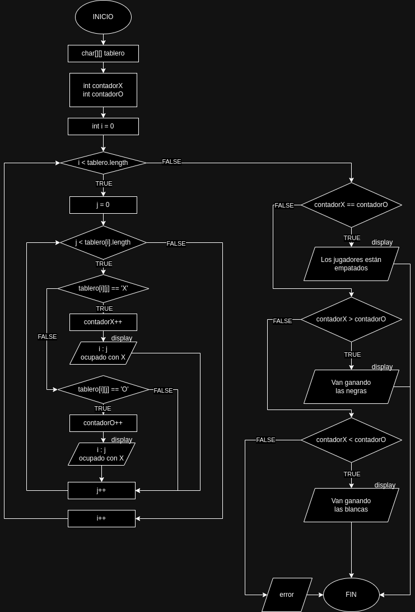

# Juego de las damas :joy:
## Funcionamiento
El juego consta de un **tablero de 8 x 8**. 
Las fichas blancas son un círculo (`'O'`) y las negras
se representan con una cruz (`'X'`). __Va ganando el juegador 
que más fichas tenga en el tablero__.
## Ordinograma

## Tablero
El tablero del juego de damas es de __8 X 8__. Es un array tipo __char__ 
para almacenar las X y O, y las casillas vacías se representan con espacios (`' '`).

El código que lo almacena sería algo así:

```java
char[][] tablero = {
        {'X', ' ', 'X', ' ', 'X', ' ', 'X', ' '},
        {' ', 'X', ' ', 'X', ' ', 'X', ' ', 'X'},
        {'X', ' ', 'X', ' ', 'X', ' ', 'X', ' '},
        {' ', ' ', ' ', ' ', ' ', ' ', ' ', ' '},
        {' ', ' ', ' ', ' ', ' ', ' ', ' ', ' '},
        {'O', ' ', 'O', ' ', 'O', ' ', 'O', ' '},
        {' ', 'O', ' ', 'O', ' ', 'O', ' ', 'O'},
        {'O', ' ', 'O', ' ', 'O', ' ', 'O', ' '}
};
```
## Por implementar
- [X] Comprobar el jugador que va ganando
 - [ ] __Separar el programa en funciones__
- [ ] Movimiento de las fichas
- [ ] Damas reina (cuando una ficha llega al otro lado del tablero)
### Funciones por implementar
- [ ] Contar negras
```java
/**
 * Cuenta todas las fichas negras del tablero (X)
 * @param tablero El array usado para el tablero
 * @return Numero de fichas negras que hay
 */
public static int contarNegras(char[][] tablero) {}
```
- [ ] Contar blancas
```java
/**
 * Cuenta todas las fichas blancas del tablero (O)
 * @param tablero El array usado para el tablero
 * @return Numero de fichas blancas que hay
 */
public static int contarBlancas(char[][] tablero) {}
```
- [ ] Comprobar ganador
```java
/**
 * Compara cuantas fichas tiene cada jugador y determina quien va ganando
 * @param nBlancas Número de fichas blancas en tablero
 * @param nNegras Número de fichas negras en tablero
 * @return Devuelve una 'X' si van ganando negras, 'O' si van ganando blancas y 'E' si van en empate.
 */
public static char comprobarGanador(int nBlancas, int nNegras) {}
```
